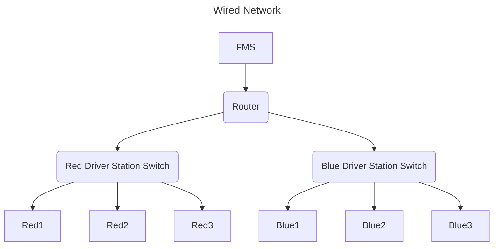

```mermaid
---
title: Wired Network
---

flowchart TD
    A[FMS] --> B(Router)
    B --> C(Red Driver Station Switch)
    C --> D[Red1]
    C --> E[Red2]
    C --> F[Red3]
    B --> G(Blue Driver Station Switch)
    G --> H[Blue1]
    G --> I[Blue2]
    G --> J[Blue3]
```
This is the code for it
```

```mermaid
---
title: Wired Network
---

flowchart TD
    A[FMS] --> B(Router)
    B --> C(Red Driver Station Switch)
    C --> D[Red1]
    C --> E[Red2]
    C --> F[Red3]
    B --> G(Blue Driver Station Switch)
    G --> H[Blue1]
    G --> I[Blue2]
    G --> J[Blue3]
```
```
