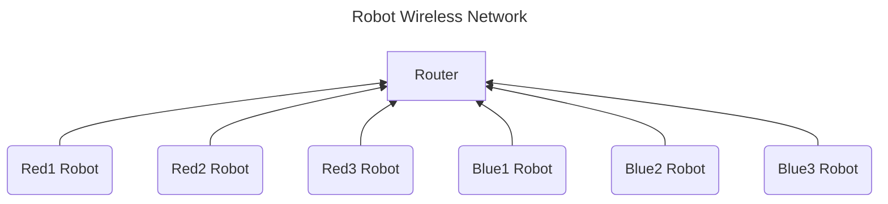

<details>

  <summary>Here is the code for the Diagram Above</summary>

  # Diagram Code
  ```
  ```mermaid
---
title: Robot Wireless Network
---

flowchart BT
    R1(Red1 Robot) --> R[Router]
    R2(Red2 Robot) --> R
    R3(Red3 Robot) --> R

    B1(Blue1 Robot) --> R
    B2(Blue2 Robot) --> R
    B3(Blue3 Robot) --> R
```


</details>
